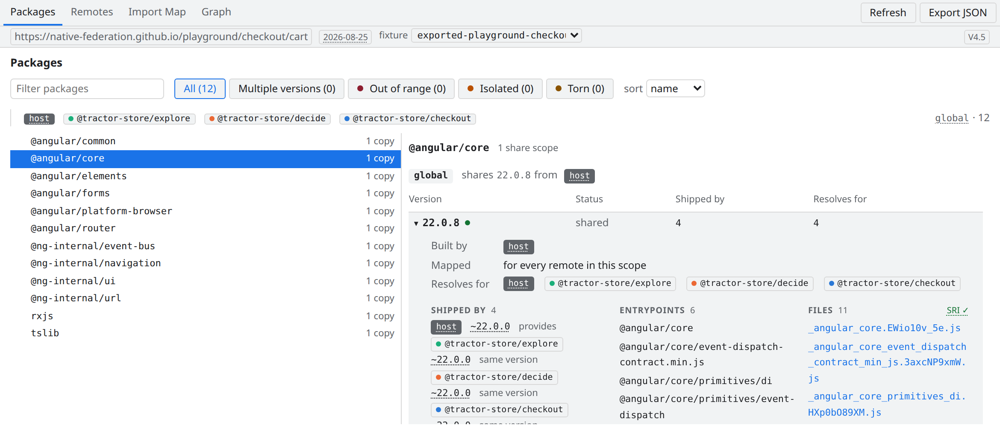

# Native Federation DevTools

**See what your micro frontends actually negotiated.**

A read-only Chrome DevTools panel for [Native Federation](https://native-federation.com) applications running the **v4 Orchestrator**.

<picture>
  <source media="(prefers-color-scheme: dark)" srcset="docs/assets/readme/hero-graph-dark.png">
  
</picture>

> *Which version of `@angular/core` won? Who provided it? Why did that remote
> end up with its own copy?*

The negotiation happens once at startup — then it disappears into the import
map. Native Federation DevTools reads it back out of the running page and
explains it: every shared package, every remote, every chunk. Evidence, not
guesses.

## What you get

- 📦 **Packages** — the negotiation, per package and share scope: every
  version, the resolver's verdict for each remote, and a deep dive into who
  ships it, its entrypoints and its files. Out-of-range remotes, isolated
  copies and torn entrypoints are called out, not averaged away.
- 🛰️ **Remotes** — each participant from its own point of view: what it
  exposes, what it declares, and where every single dependency really
  resolves.
- 🕸️ **Graph** — remotes, dependency copies, and chunks as one traceable
  picture. Hover to trace, click to filter.
- 🗺️ **Import Map** — the effective map, row by row, each entry attributed
  to its package, its provider, and the chunk bundle that serves it.
- 📤 **Export JSON** — freeze the entire snapshot to a file. Doubles as a
  reproducible bug report.
- 🔒 **Read-only, zero permissions** — no host permissions, no content
  scripts. The panel inspects; it never mutates the page. Enforced by tests,
  not by convention.

In progress: **Diagnostics** (registry↔map lint) and global search.

## Hover to trace

One hover answers *"who shares this — and which files does it load?"*

<picture>
  <source media="(prefers-color-scheme: dark)" srcset="docs/assets/readme/hover-trace-dark.gif">
  
</picture>

Dashed nodes are isolated copies, dotted edges are borrowed dependencies —
the sharing story is visible at a glance.

## Every negotiation, explained

<picture>
  <source media="(prefers-color-scheme: dark)" srcset="docs/assets/readme/packages-dark.png">
  
</picture>

Four remotes ship `@angular/core` 22.0.8: the host's build is shared, the
other three resolve to it, and every entrypoint and file is accounted for, SRI
included. A remote whose range rejects the shared version is flagged even when
it isn't strict — the orchestrator stores a plain skip for it.

## Every remote, from its own point of view

<picture>
  <source media="(prefers-color-scheme: dark)" srcset="docs/assets/readme/remotes-dark.png">
  
</picture>

Exposes, provided packages, and — line by line — which dependency this remote
consumes from whom, and which own version lost the negotiation.

## Requirements

> **Requires the v4 Orchestrator.** The panel reads the registry that
> [`@softarc/native-federation-orchestrator`](https://github.com/native-federation/orchestrator)
> keeps in the page (`window.__NATIVE_FEDERATION__`). Applications on the
> classic **v3 runtime** (`@softarc/native-federation-runtime`) do not expose
> this registry and are **not supported** — on such pages the panel shows
> *No Native Federation detected*.

## Install

🛒 **Chrome Web Store: coming soon** — the extension will be published under
the official Native Federation presence. Until then, install it from a GitHub
release. No build toolchain needed — it takes about a minute.

### From a release

1. Download `native-federation-devtools-<version>.zip` from the
   [releases page](https://github.com/native-federation/devtools/releases)
   and unzip it into a folder of its own (the zip has no top-level folder).
   Keep that folder — Chrome loads the extension from it.
2. Open `chrome://extensions` in Chrome — type it into the address bar.
3. Turn on **Developer mode** (toggle in the top-right corner).
4. Click **Load unpacked** and select the unzipped folder.
5. Open Chrome DevTools (`F12`, or `Ctrl+Shift+I` / `⌥⌘I`) on an application
   that runs the v4 Orchestrator. The panel appears as a new
   **Native Federation** tab — if DevTools was already open, close and reopen
   it once.

Unpacked extensions do not update themselves. To upgrade, unzip the new
release into the same folder and click the ↻ reload icon on the extension's
card in `chrome://extensions`. Automatic updates come with the Web Store.

### From source

Contributors can build the extension themselves — see
[Development & Architecture](docs/DEVELOPMENT.md#install-development-build).

## Native Federation ecosystem

| Project | What it is |
| --- | --- |
| [native-federation.com](https://native-federation.com) | Project home — docs, guides, team, resources |
| [orchestrator](https://github.com/native-federation/orchestrator) | Runtime micro frontend orchestrator (v4) — the runtime this panel reads |
| **devtools** (this repo) | Chrome DevTools panel for inspecting running federations |

## Documentation

- [Development & Architecture](docs/DEVELOPMENT.md) — build, run, test,
  repository layout, and the design constraints behind the tool
- [Resolution data model](docs/resolution-data-model.md) — how a captured
  snapshot becomes the model behind the views

## About

Developed and maintained by [Lutz Leonhardt](https://lutzleonhardt.de) as
part of the official Native Federation project.

Built in an agentic workflow with Claude Code and Codex as pair programmers —
architecture, review, and verification stay with the maintainer.

Licensed under [MIT](LICENSE).
